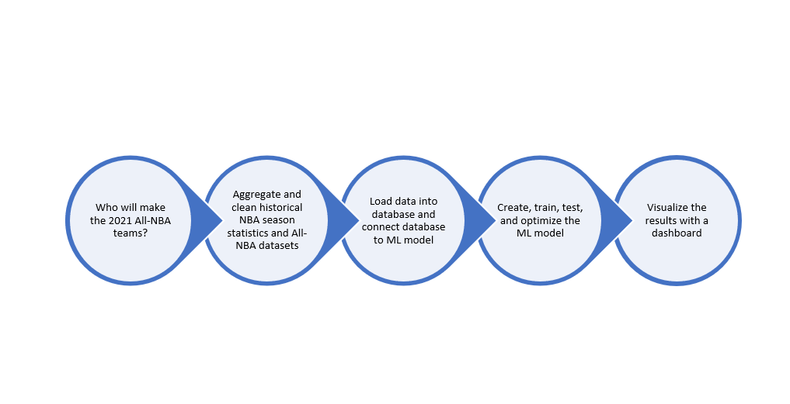
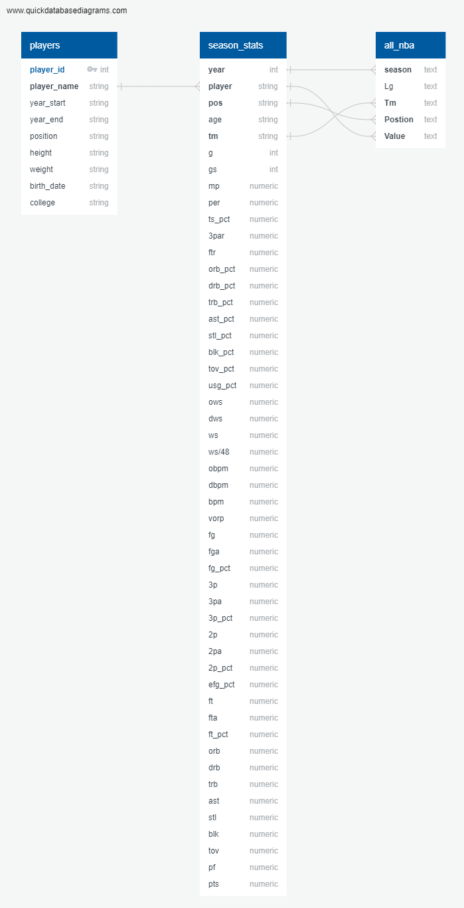
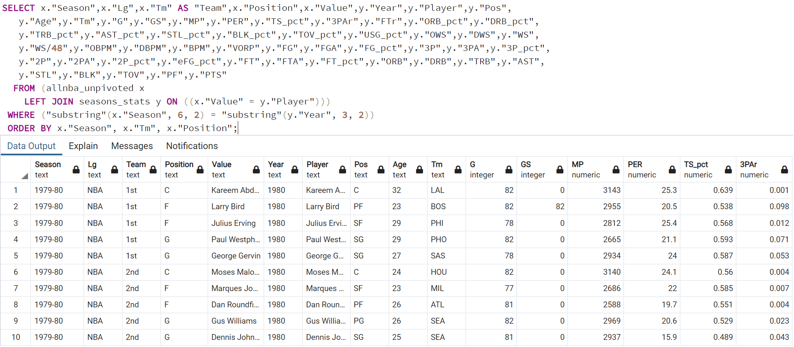
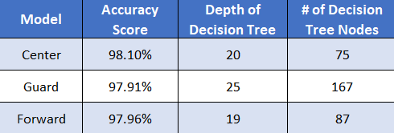
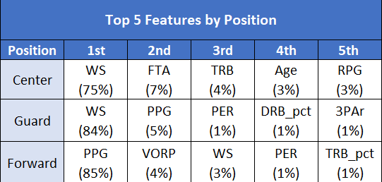
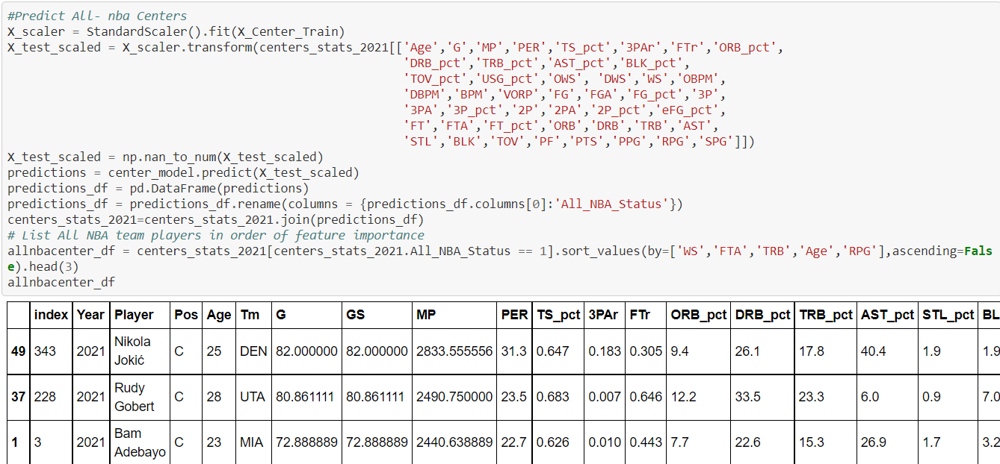
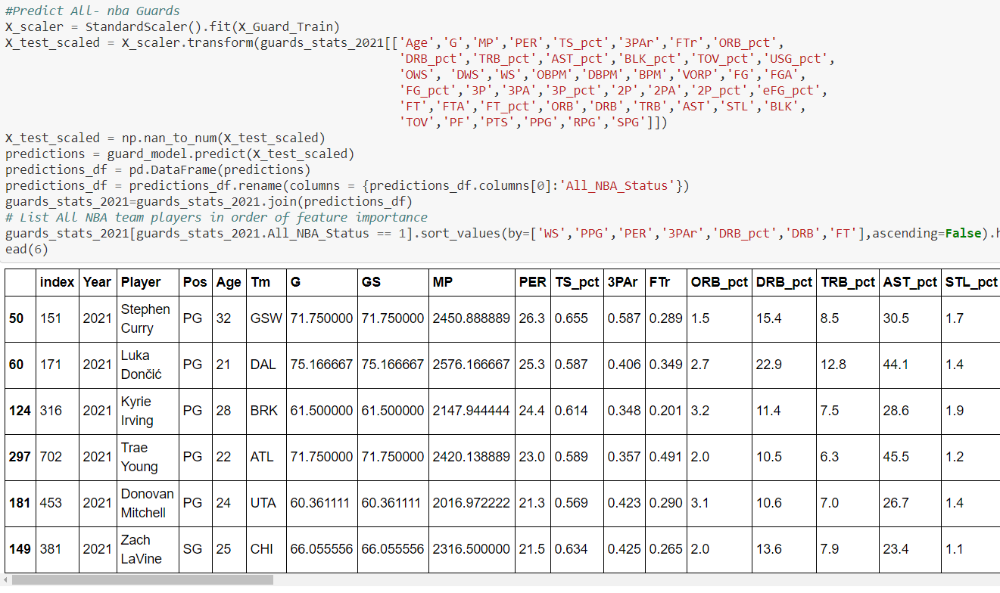
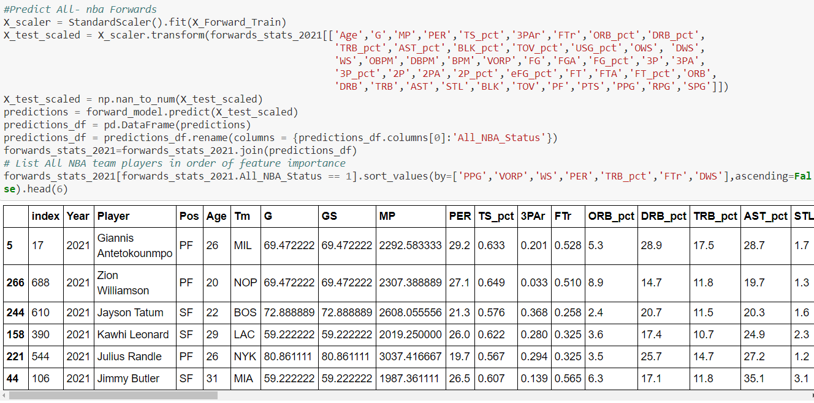

# All-NBA Team Machine Learning Model

## Project Overview

__Topic Selection__

- We set out to determine if we could build a machine learning model that takes in an NBA player's end-of-season statistics and reliably predicts whether or not that player will make one of the three All-NBA teams at the end of a season. We selected this topic for a few different reasons. First and foremost, we are all avid sports fans who are curious about the predictability of various end-of-season awards (e.g., MVP, offensive player of year, rookie of the year, etc.). As you ride each season’s ups and downs with your favorite players and teams, it’s extremely rewarding when your favorite player receives one of these prestigious awards and cements their greatness in the history books. Our second reason for selecting this topic is the potential for monetizing it. There are numerous bets available for all sorts of individual awards each season across all sports. Optimizing this model would be a effective and potentially lucrative learning experience on how to give your betting an edge.
  
__Data sources__

- [NBA Players' Season Stats from Kaggle](https://www.kaggle.com/drgilermo/nba-players-stats) - This dataset contains a variety of players' game statistics like points, rebounds, assists, PER, etc.
- [All-NBA team data from Basketball Reference](https://www.basketball-reference.com/awards/all_league.html) - This dataset contains the list of 1st, 2nd, and 3rd All-NBA team awards from 1946-2020.
- [NBA Players' demographic data from Kaggle](https://www.kaggle.com/drgilermo/nba-players-stats) - This dataset contains the players' demographic data (e.g., start/end of career, birthdate, height, weight, college).
- [Glossary of Basketball Statistics](Stat_Glossary.xlsx)

__Questions we hope to answer with the data__

1) Can our model predict whether or not a player will make an All-NBA team with a 95% accuracy or higher?

2) What were the top 5 variables by weight in our model?

## Database

  

- The ERD diagram above demonstrates how the data is structured in our postgreSQL database. [Here you can see](final_project_segment-oversampling-predictions-treeVisuals.ipynb) how our  model is connected to our postgreSQL database, as well as how the model reads in the All-NBA and season stats tables. We also [scraped the 2020-2021 season data from Basketball Reference and connected the results](Database/load_season_data.py) to our season stats database. Finally, we [scraped and connected the 2020-2021 results to a different table](Database/load_test_data.py) for testing purposes.

- A materialized view called allnba_stats was created to the join the All NBA players with their associated season stats. This will give an overview of the players' season that got them on an All NBA team.
  

## Machine Learning Model

- [Click here to review our complete ML model.](final_project_segment-oversampling-predictions-treeVisuals.ipynb)

- We chose a supervised machine learning (ML) model for classification. We chose this type of model because we wanted a model that would predict discrete outcomes. In this case, our model tries to learn patterns from historical end-of-season stats, All-NBA team awards, and demographic data, and, if successful, will be able to make accurate predictions about which players will make one of the All-NBA teams this year based on their own end-of-season stats.

- The model starts by reading in the All-NBA and season stats tables from our database. Preprocessing the data involved several steps, some of which were: (a) cutting off data prior to 1979 to account for inconsistent record keeping and the lack of the 3-point line, (b) converting season totals to per game statistics, (c) normalizing stats for years where the season was less than 82 games, and (d) aggregating statistics for players that were traded during the seasons. 
 
- Because there are 3 All-NBA teams, each made up of one center, two forwards, and two guards, we decided to develop a ML model for each position. For each position (C, F, G), we split the data into training and testing sets, created a standard scalar, fit the testing and training sets to the standard scalar, and then scaled each training and testing set. From there, we used a decision tree classifier to fit our data, make predictions using the testing data, and calculate a confusion matrix and accuracy score. After several tests with different types of models, we decided to proceed with a random oversampling model, as its precision, recall, and accuracy was superior to our attempts with [undersampling](ML_testing/final_project_segment-undersampling.ipynb), [SMOTE](ML_testing/final_project_segment-SMOTE.ipynb), and [SMOTEENN](ML_testing/final_project_segment-SMOTEENN.ipynb). To optimize the model and reduce the risk of overfitting, we eliminated features that yielded 0% for all positions (WS/48, STL_pct, APG, GS). The only changes made between segment 2 and segment 3 were the recalculatiion of statistics for players traded within the season. 

### Final accuracy scores and decision tree depth/nodes by model

### Top 5 Features by Position

### Final Model Predictions by Position

__1. Centers__

__2. Guards__

__3. Forwards__

## Dashboard Blueprint

- [Click here to review the funcionality of the flask app](DashScreencap.mov).
- Click to review the [app.py file for the flask app](app.py), [html files](templates), or the [css file](static/css.style.css) for the dashboard.

## Google Slides Presentation

- [Link to Google Slides Presentation](https://docs.google.com/presentation/d/1bqlYrNKM-4Ca5ZYvfy-4j8Vt1VdozmSWU7uQp4couyM/edit#slide=id.g1f87997393_0_782) 

