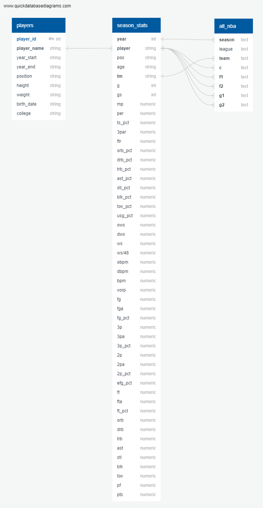

# All-NBA Team Machine Learning Model

## Project Overview

__Topic Selection__

- We set out to determine if we could build a machine learning model that takes in an NBA player's end-of-season statistics and reliably predicts whether or not that player will make an All-NBA team at the end of a season. We selected this topic for a few different reasons. First and foremost, we are all avid sports fans who are curious about the predictability of various end-of-season awards (e.g., MVP, offensive player of year, rookie of the year, etc.). As you ride each season’s ups and downs with your favorite players and teams, it’s extremely rewarding when your favorite player receives one of these prestigious awards and cements their greatness in the history books. Our second reason for selecting this topic is the potential for monetizing it. There are numerous bets available for all sorts of individual awards each season across all sports. Optimizing this model would be a effective and potentially lucrative learning experience on how to give your betting an edge.
  
__Data sources__

- [Season_Stats.csv from Kaggle](https://www.kaggle.com/drgilermo/nba-players-stats) - This dataset contains a variety of players' game statistics like points, rebounds, assists, PER, etc.
- [All-NBA data.csv from Basketball Reference](https://www.basketball-reference.com/awards/all_league.html) - This dataset contains the list of 1st, 2nd, and 3rd All-NBA team awards from 1946-2020.
- [player_data.csv from Kaggle](https://www.kaggle.com/drgilermo/nba-players-stats) - This dataset contains the players' demographic data (e.g., start/end of career, birthdate, height, weight, college).

__Questions we hope to answer with the data__

- Can our model predict whether or not a player will make an All-NBA team with a 95% accuracy or higher?
- Which variables had the highest weight in our model?
- Which variables had the lowest weight in our model?
- Which variables did we remove when optimizing the model that surprised us the most?

__Team Communication Protocols__

- Questions and updates are posted in the group Slack channel and all team members' phone numbers are available in case emergency communication is necessary.
- Meetings outside of Monday and Wednesday classes are coordinated in the group Slack channel and are scheduled as needed.
- Merge requests, comments, and other Github activity are set up to automatically notify the "Github Master" via email.

## Machine Learning Model

- The first segment is all about preparation, so a simple model will cover the first question—the type of machine learning model chosen and why. To get started, create a simple model that isn't concerned with accuracy. Basically, you want your model to take input data and return a label—and that's it!

- The technologies employed were..
- We chose the XXXXXX model because...why...
- We are training our model...in what ways...with what...
- Our model's accuracy was....
- Our model works by...

## Database

- This means you're using a SQL-based database, including an ERD of the database and a document pointing out how it is integrated into your database and how it works with the code. 
- When you submit this database for your weekly grade, make sure you're submitting the data used for testing as well. Make sure to upload it to the repository along with the rest of the database-related work.

- The technologies employed were... 
- sadfasdf
- ERD diagram

## Dashboard

- Not due in Segment One

