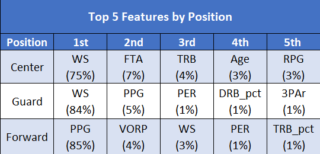

# All-NBA Team Machine Learning Model

## Project Overview

__Topic Selection__

- We set out to determine if we could build a machine learning model that takes in an NBA player's end-of-season statistics and reliably predicts whether or not that player will make one of the three All-NBA teams at the end of a season. We selected this topic for a few different reasons. First and foremost, we are all avid sports fans who are curious about the predictability of various end-of-season awards (e.g., MVP, offensive player of year, rookie of the year, etc.). As you ride each season’s ups and downs with your favorite players and teams, it’s extremely rewarding when your favorite player receives one of these prestigious awards and cements their greatness in the history books. Our second reason for selecting this topic is the potential for monetizing it. There are numerous bets available for all sorts of individual awards each season across all sports. Optimizing this model would be a effective and potentially lucrative learning experience on how to give your betting an edge.
  
__Data sources__

- [NBA Players' Season Stats from Kaggle](https://www.kaggle.com/drgilermo/nba-players-stats) - This dataset contains a variety of players' game statistics like points, rebounds, assists, PER, etc.
- [All-NBA team data from Basketball Reference](https://www.basketball-reference.com/awards/all_league.html) - This dataset contains the list of 1st, 2nd, and 3rd All-NBA team awards from 1946-2020.
- [NBA Players' demographic data from Kaggle](https://www.kaggle.com/drgilermo/nba-players-stats) - This dataset contains the players' demographic data (e.g., start/end of career, birthdate, height, weight, college).
- [Glossary of Basketball Statistics](Stat_Glossary.xlsx)

__Questions we hope to answer with the data__

1) Can our model predict whether or not a player will make an All-NBA team with a 95% accuracy or higher?
2) Which variables had the highest weight in our model?
3) Which variables had the lowest weight in our model?
4) Which variables did we remove when optimizing the model that surprised us the most?

__Team Communication Protocols__

- Questions and updates are posted in the group Slack channel and all team members' phone numbers are available in case emergency communication is necessary.
- Meetings outside of Monday and Wednesday classes are coordinated in the group Slack channel and are scheduled as needed.
- Merge requests, comments, and other Github activity are set up to automatically notify the "Github Master" via email.

## Database

  

- The ERD diagram above demonstrates how the data is structured in our postgreSQL database. [Here you can see](final_project_segment-oversampling-predictions-treeVisuals.ipynb) how our  model is connected to our postgreSQL database, as well as how the model reads in the All-NBA and season stats tables. Additionally, 

Evidence of join?
Quick explanation for [Load season data connection](Database/load_season_data.py)
Quick explanation for[Load test data connection](Database/load_test_data.py)

## Machine Learning Model

- [Click here to review our complete ML model.](final_project_segment-oversampling-predictions-treeVisuals.ipynb)

- We chose a supervised machine learning (ML) model for classification. We chose this type of model because we wanted a model that would predict discrete outcomes. In this case, our model tries to learn patterns from historical end-of-season stats, All-NBA team awards, and demographic data, and, if successful, will be able to make accurate predictions about which players will make one of the All-NBA teams this year based on their own end-of-season stats.

 The model starts by reading in the All-NBA and season stats tables from our database. Preprocessing the data involved several steps, some of which were: (a) cutting off data prior to 1979 to account for inconsistent record keeping and the lack of the 3-point line, (b) converting season totals to per game statistics, and (c) normalizing stats for years where the season was less than 82 games. 
 
 Preliminary feature engineering, selection, and decision-making involved...

Description of how data was split into testing and training...

Explanation of model choice, benefits, limiations...

Top 5 Features by Position

### Model predictions

Centers

Guards

Forwards

## Dashboard Blueprint

