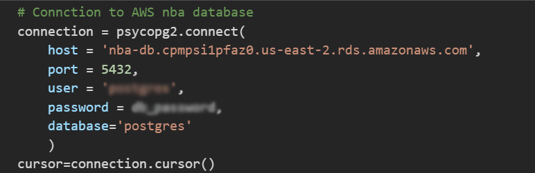
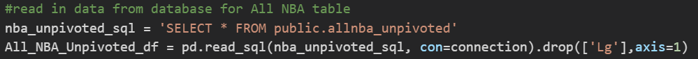
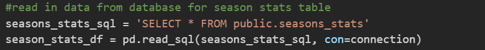

# All-NBA Team Machine Learning Model

## Project Overview

__Topic Selection__

- We set out to determine if we could build a machine learning model that takes in an NBA player's end-of-season statistics and reliably predicts whether or not that player will make an All-NBA team at the end of a season. We selected this topic for a few different reasons. First and foremost, we are all avid sports fans who are curious about the predictability of various end-of-season awards (e.g., MVP, offensive player of year, rookie of the year, etc.). As you ride each season’s ups and downs with your favorite players and teams, it’s extremely rewarding when your favorite player receives one of these prestigious awards and cements their greatness in the history books. Our second reason for selecting this topic is the potential for monetizing it. There are numerous bets available for all sorts of individual awards each season across all sports. Optimizing this model would be a effective and potentially lucrative learning experience on how to give your betting an edge.
  
__Data sources__

- [Season_Stats.csv from Kaggle](https://www.kaggle.com/drgilermo/nba-players-stats) - This dataset contains a variety of players' game statistics like points, rebounds, assists, PER, etc.
- [All-NBA data.csv from Basketball Reference](https://www.basketball-reference.com/awards/all_league.html) - This dataset contains the list of 1st, 2nd, and 3rd All-NBA team awards from 1946-2020.
- [player_data.csv from Kaggle](https://www.kaggle.com/drgilermo/nba-players-stats) - This dataset contains the players' demographic data (e.g., start/end of career, birthdate, height, weight, college).

__Questions we hope to answer with the data__

1) Can our model predict whether or not a player will make an All-NBA team with a 95% accuracy or higher?
2) Which variables had the highest weight in our model?
3) Which variables had the lowest weight in our model?
4) Which variables did we remove when optimizing the model that surprised us the most?

__Team Communication Protocols__

- Questions and updates are posted in the group Slack channel and all team members' phone numbers are available in case emergency communication is necessary.
- Meetings outside of Monday and Wednesday classes are coordinated in the group Slack channel and are scheduled as needed.
- Merge requests, comments, and other Github activity are set up to automatically notify the "Github Master" via email.

## Machine Learning Model

- We chose a supervised machine learning model for classification. We chose this type of model because we wanted a model that would predict discrete outcomes. In this case, we wanted to take a player's end-of-season stats (e.g., points/rebounds/assists per game) and demographic data (e.g., age, height, weight, college) and predict whether the player will or will not make an All-NBA team. In other words, our classification model will try to learn patterns from our end-of-season stats and demographic data that, if successful, can make accurate predictions on if a player will win that award.
- Below is our provisional machine learning model that takes in the data from our provisional database and ouputs the labels for our input data. 

[Full MLM model file](final_project_segment.ipynb)

(snapshots of key code snippets)

## Database

- The following code demonstrates how our machine learning model is connected to our postgreSQL database.

  
  
  

- The ERD diagram below demonstrates how our data is structured in our postgreSQL database.

  

## Dashboard

- TBD as this section is not due in segment #1.

